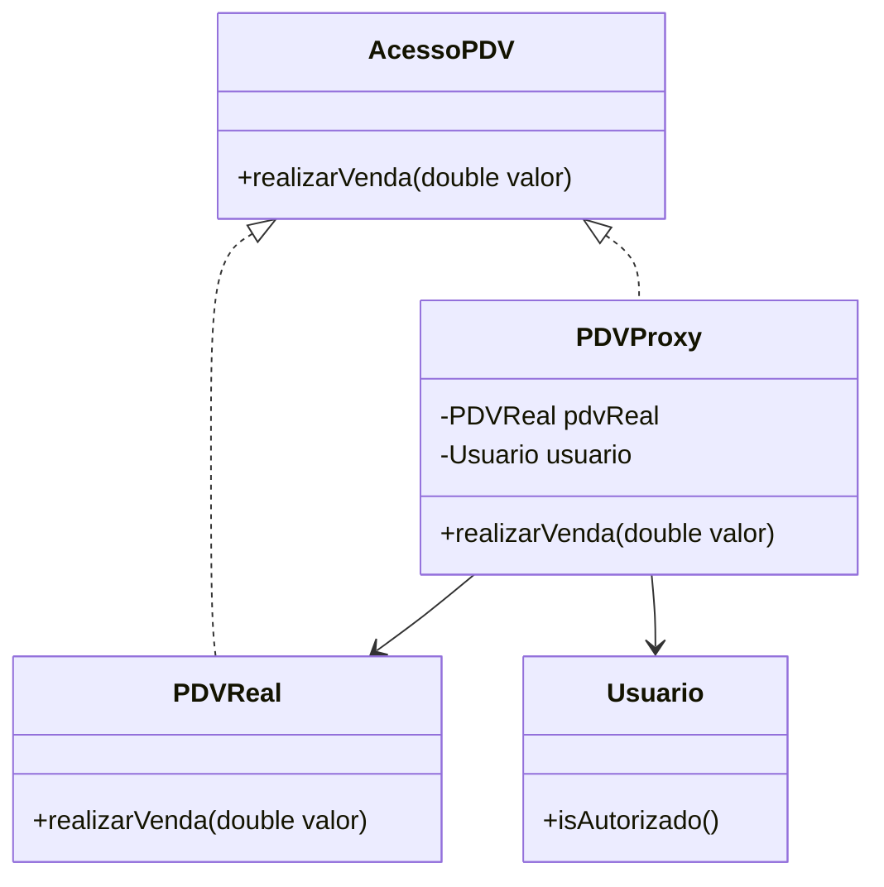

# Padrão Proxy: Controle de Acesso ao PDV

## Motivação
O padrão de projeto **Proxy** permite controlar o acesso a um objeto, adicionando uma camada intermediária que gerencia requisições. Isso é útil para segurança, controle de permissões, caching e logging.

Neste exemplo, aplicamos o **Proxy** no sistema **PDV (Ponto de Venda)** para controlar o acesso a transações de vendas. O Proxy valida se o usuário tem permissão para realizar vendas antes de permitir o acesso ao PDV real.

## UML do Proxy no PDV

## Código do Proxy

### **Interface AcessoPDV**

@import "src/pdv/proxy/AcessoPDV.java"

### **Classe PDVReal: Implementação Real do PDV**

@import "src/pdv/proxy/PDVReal.java"

### **Classe PDVProxy: Controla o Acesso ao PDV Real**

@import "src/pdv/proxy/PDVProxy.java"

### **Classe Usuario: Representa os Usuários do Sistema**

@import "src/pdv/model/Usuario.java"

### **Implementação do Cliente (Main)**

@import "src/pdv/main/Main.java"

## Explicação do Código
- **Interface `AcessoPDV`** define o contrato para a operação `realizarVenda()`.
- **Classe `PDVReal`** contém a lógica real para realizar uma venda no PDV.
- **Classe `PDVProxy`** controla o acesso ao `PDVReal`:
   - Verifica se o usuário tem permissão para realizar a venda antes de permitir a operação.
- **Classe `Usuario`** representa os usuários do sistema e possui a funcionalidade de verificar se o usuário é autorizado a realizar vendas.
- **Classe `Main`** simula o funcionamento do sistema, tentando realizar vendas com usuários autorizados e não autorizados.

## Participantes

- **Sujeito (`AcessoPDV`)**  
  - Define o contrato para realizar a venda no PDV.

- **Sujeito Real (`PDVReal`)**  
  - Implementa a lógica real para realizar a venda no PDV.

- **Proxy (`PDVProxy`)**  
  - Controla o acesso ao `PDVReal`, validando se o usuário está autorizado antes de permitir a venda.

- **Cliente (`Main`)**  
  - Realiza requisições para o Proxy, testando a venda com usuários autorizados e não autorizados.
